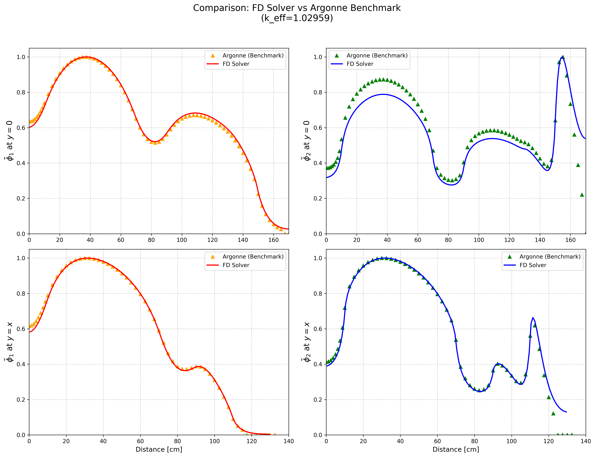
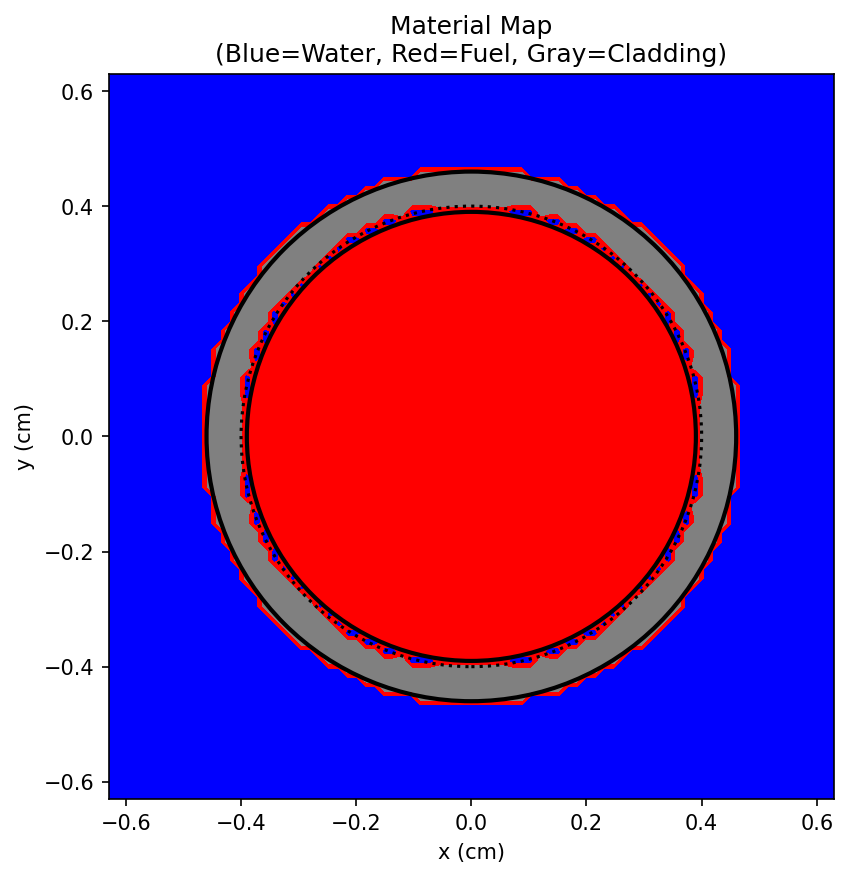
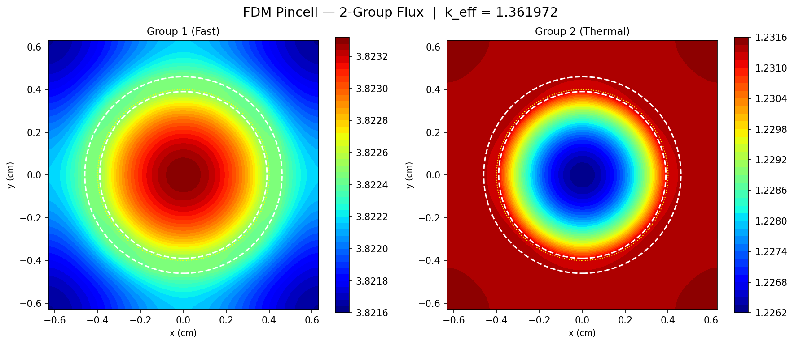
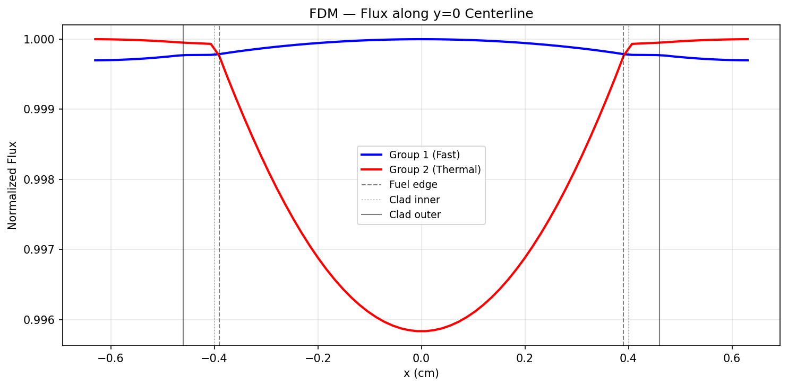
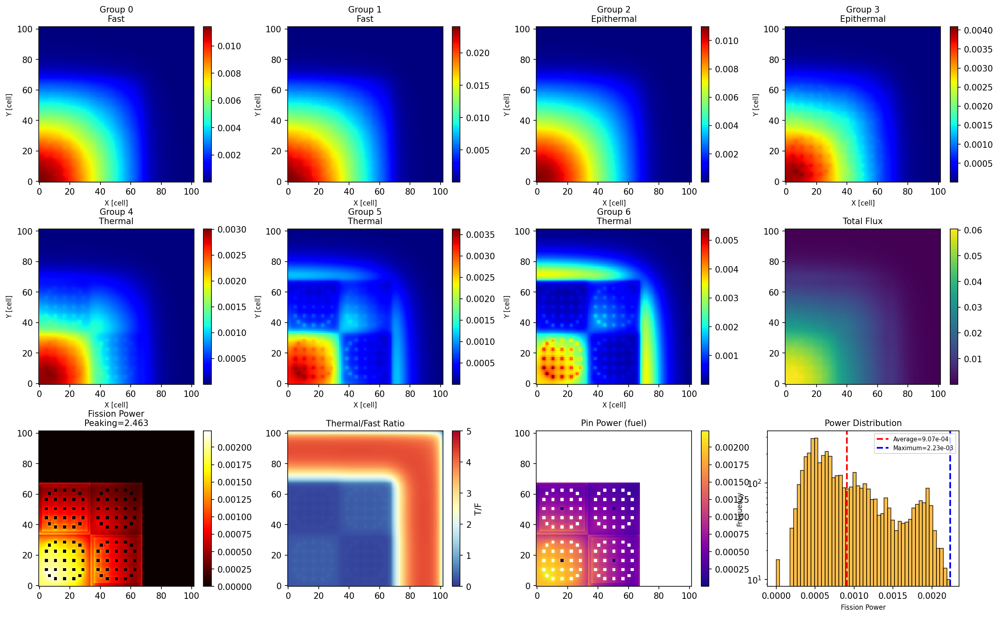
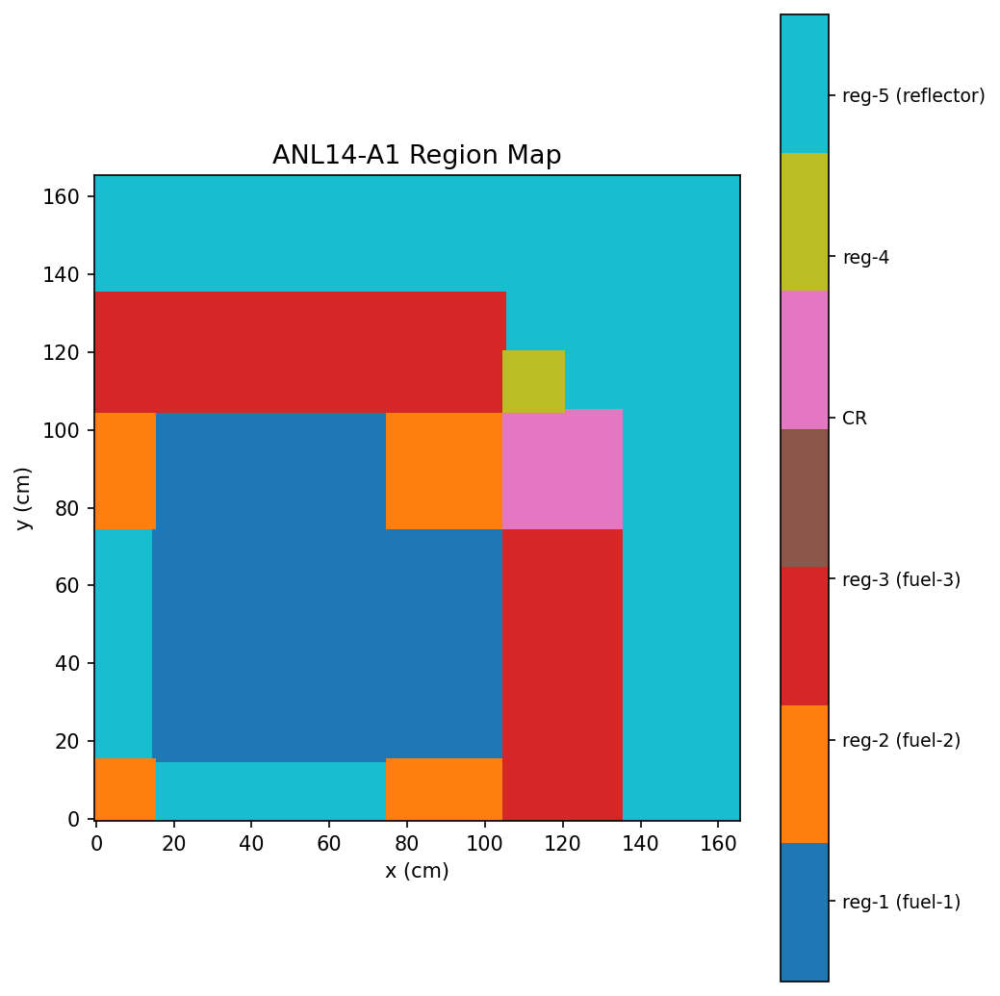
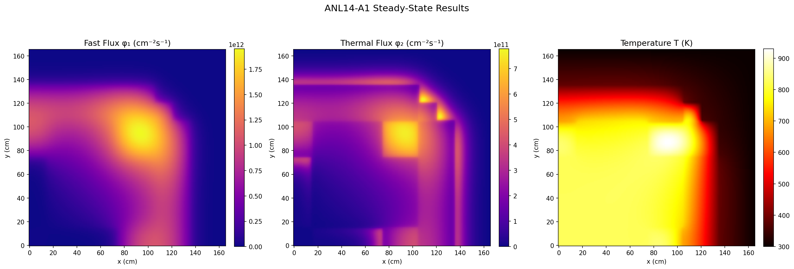
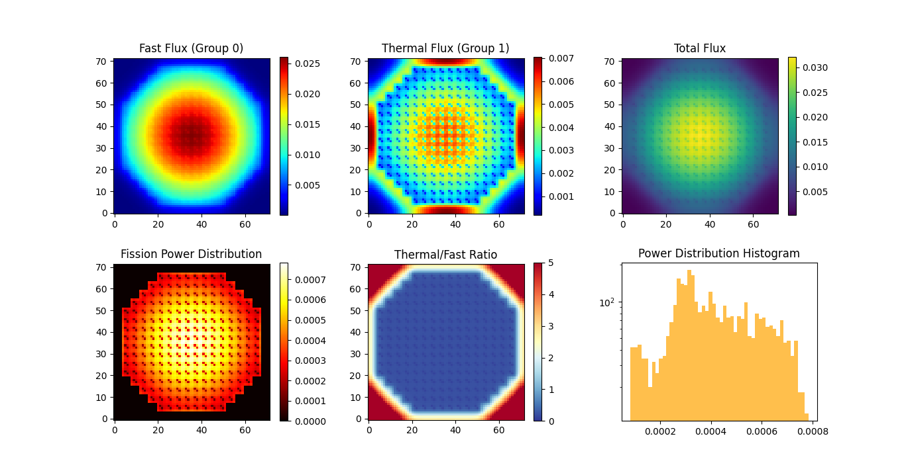
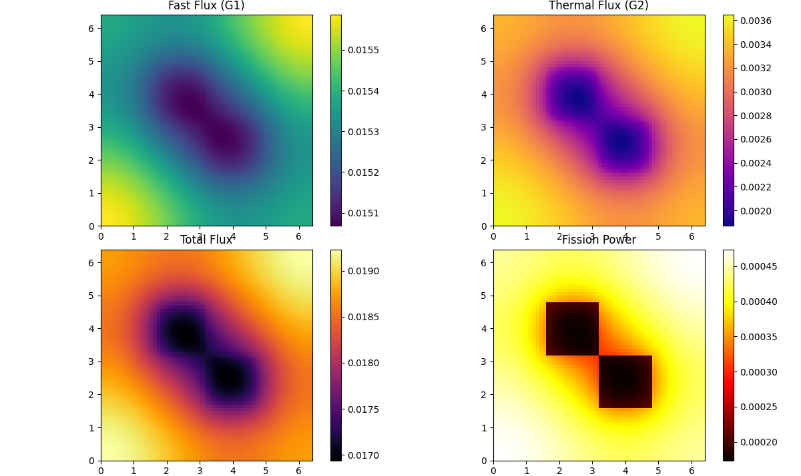

# NucBenC-CPP-PY
Simple and fast nuclear reactor physics benchmarks in Python &amp; C++
Benchmark Problems implemented in **Python** and **C++**.

This repository contains simple, clean, and educational implementations of well-known neutron transport and diffusion benchmarks such as:

### 1. ANL 11-A2 (2D IAEA)
- Two-group neutron diffusion
- k-eigenvalue problem
- Finite Difference (FD)
- Python version
### 2. Pincell 2Group
- Two-group neutron diffusion
- k-eigenvalue problem
- Finite Difference (FD)
- Python version
### 3. C5G7 
- neutron diffusion
- k-eigenvalue problem
- Finite Difference (FD)
- Python version
### 4. ANL14-A1 Benchmark: 2-Group Neutron Diffusion + Thermal Feedback
- Two-group neutron diffusion
- k-eigenvalue problem
- Finite Difference (FD)
- Python version
### 5. BWR Core Benchmark: 2-Group Neutron Diffusion on 72×72 Pin-Level Lattice
- Two-group neutron diffusion equation  
- k-eigenvalue (criticality) problem solved via power iteration  
- Finite Difference Method (FD) for spatial discretization  
- 72×72 pin-level heterogeneous core model  
- Material regions: UO₂ fuel, Gd-bearing fuel, and moderator (water)  
- Sparse matrix formulation for efficient computation  
- Implemented in Python using NumPy and SciPy
## 📊 Features

- Sparse matrix assembly (SciPy / Eigen)
- Power iteration eigenvalue solver
- Flux visualization (Matplotlib)
- Benchmark comparison (Argonne data)

---

## ⚙️ Requirements

### Python
- numpy
- scipy
- matplotlib
- pandas

pip install numpy scipy matplotlib pandas
## 🚀 Purpose

The goal of this repository is to:

- Provide **clear and minimal implementations**
- **Python vs C++ performance**
- Help understanding **numerical reactor physics**
- Serve as a **learning resource**

## 📂 Structure

Each benchmark is stored in a separate folder:
